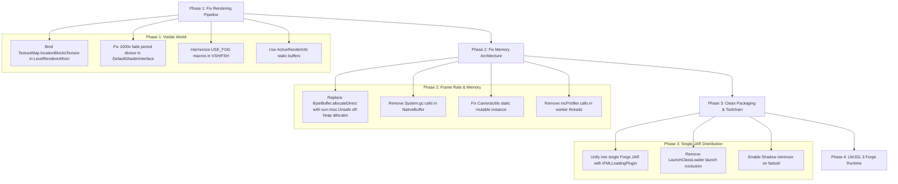

# SodiumForge — Complete Technical Documentation & Architecture Reference

**Project:** Port of **Radium** (the [SonaGG/Radium](https://github.com/SonaGG/Radium) fork of Sodium for Minecraft 1.8.9) from **Legacy Fabric / Ornithe** to **Minecraft Forge 1.8.9**.  
**Target Environment:** Minecraft 1.8.9 / Forge 11.15.1.2318 / MCP Mappings `stable_22` / Java 8.  
**Upstream Reference:** Local clone in [`Radium-Reference/`](./Radium-Reference) (`SonaGG/Radium` commit `71c47e96`).  
**Upstream Core Dependency:** [`legacy-lwjgl3`](https://github.com/Zarzelcow/legacy-lwjgl3) by Zarzelcow / Moehreag (`io.github.moehreag:legacy-lwjgl3`).  

---

## Table of Contents

1. [Project Overview & Upstream Architecture](#1-project-overview--upstream-architecture)
2. [The Zarzelcow `legacy-lwjgl3` Dependency & The "LWJGL 2 Rewrite" Failure](#2-the-zarzelcow-legacy-lwjgl3-dependency--the-lwjgl-2-rewrite-failure)
3. [Deep Diagnosis: Root Causes of Critical Bugs](#3-deep-diagnosis-root-causes-of-critical-bugs)
   - 3.1 [Why the World is Completely Invisible](#31-why-the-world-is-completely-invisible)
   - 3.2 [Why Performance Drops to ~6 FPS with 5.7-Second Freezes](#32-why-performance-drops-to-6-fps-with-57-second-freezes)
   - 3.3 [Thread Safety & Concurrency Violations](#33-thread-safety--concurrency-violations)
4. [Audit & Correction of False Claims in Previous Documentation](#4-audit--correction-of-false-claims-in-previous-documentation)
5. [Toolchain, Build Environment & Packaging](#5-toolchain-build-environment--packaging)
   - 5.1 [Build Configuration & Dependencies](#51-build-configuration--dependencies)
   - 5.2 [Single-JAR vs Two-JAR Deployment](#52-single-jar-vs-two-jar-deployment)
6. [MCP 1.8.9 Mapping Reference (Legacy Yarn → MCP `stable_22`)](#6-mcp-189-mapping-reference-legacy-yarn--mcp-stable_22)
7. [Mixin Inventory & Status](#7-mixin-inventory--status)
8. [Actionable Implementation Roadmap](#8-actionable-implementation-roadmap)

---

## 1. Project Overview & Upstream Architecture

### 1.1 What is SonaGG/Radium?
[SonaGG/Radium](https://github.com/SonaGG/Radium) is a 1.8.9 backport of modern CaffeineMC Sodium (0.5.x/0.6.x/0.8.x rendering architecture) built for the **Legacy Fabric** and **Ornithe** modding ecosystems.

Key architectural pillars of modern Sodium:
- **Direct Off-Heap Memory Management:** Chunk meshing, quad encoding, and vertex building utilize native C-heap memory operations (`MemoryUtil.nmemAlloc`, `memRealloc`, `memFree`, `MemoryStack`, and raw 64-bit `memAddress` pointers).
- **Modern OpenGL Capabilities:** Uniform Buffer Objects (UBOs), persistent mapped buffers (`GL_MAP_PERSISTENT_BIT` via `ARB_buffer_storage`), and hardware multi-draw indirect (`glMultiDrawElementsBaseVertex`).
- **Modern Runtime Ecosystem:** Runs on Java 17+ via modern Fabric Loader (>=0.16.0) and uses Ploceus / Legacy-Yarn v2 intermediary generation 2 to remap names at build time.

### 1.2 Upstream Dependency Chain
```
[Minecraft 1.8.9 Vanilla] (Stock LWJGL 2.9.4, Java 8)
          │
          ▼
[Legacy Fabric / Ornithe Loader] (Java 17/21 runtime, Mixin 0.8.5)
          │
          ▼
[legacy-lwjgl3 (Zarzelcow / Moehreag)] (Replaces LWJGL 2 with real LWJGL 3 + LWJGL 2 API Shims)
          │
          ▼
[SonaGG/Radium] (Written against LWJGL 3 MemoryUtil + Modern GL33/GL43/GL45)
```

In upstream Radium's [`fabric.mod.json`](file:///home/e/dev/SodiumForge/Radium-Reference/fabric/src/main/resources/fabric.mod.json#L80-L84):
```json
"depends": {
  "minecraft": ["1.8.9"],
  "fabricloader": ">=0.16.0",
  "legacy-lwjgl3": ">=1.2.11"
}
```

---

## 2. The Zarzelcow `legacy-lwjgl3` Dependency & The "LWJGL 2 Rewrite" Failure

### 2.1 The Purpose of Zarzelcow's `legacy-lwjgl3`
Vanilla Minecraft 1.8.9 natively runs on the obsolete **LWJGL 2.9.4** library. LWJGL 2 lacks:
1. `org.lwjgl.system.MemoryUtil` and `MemoryStack` for off-heap allocations and reallocations.
2. Modern OpenGL bindings (`GL33C`, `GL43C`, `GL45C`, DSA, `glMultiDrawElementsBaseVertex`).
3. 64-bit raw pointer buffer passing.

**Zarzelcow** created [`legacy-lwjgl3`](https://github.com/Zarzelcow/legacy-lwjgl3) (originating from Gudenau's `MC-LWJGL3`, later maintained by Moehreag) to replace Minecraft's underlying display, input, sound, and OpenGL bindings with **real LWJGL 3**, while offering LWJGL 2-named wrapper classes (`org.lwjgl.opengl.Display`, `Keyboard`, `Mouse`, `BufferUtils`) so vanilla 1.8.9 code runs unmodified.

### 2.2 Why the "Stock LWJGL 2 Native Rewrite" Destroyed Performance
The `SodiumForge` port attempted to abandon `legacy-lwjgl3` and rewrite Sodium's engine to run purely on stock LWJGL 2. This introduced catastrophic design flaws:

#### A. Managed `ByteBuffer.allocateDirect()` vs Native C-Heap Memory
In upstream Sodium, vertex mesh generation allocates native memory via CRT `malloc`/`realloc`/`free` through `MemoryUtil`. These allocations execute in nanoseconds and are freed immediately when mesh building completes.

In `SodiumForge`:
- [`ChunkMeshBufferBuilder.java`](file:///home/e/dev/SodiumForge/src/main/java/net/caffeinemc/mods/sodium/client/render/chunk/vertex/builder/ChunkMeshBufferBuilder.java#L72-L87) calls `ByteBuffer.allocateDirect()` on every chunk start and growth:
  ```java
  ByteBuffer newBuffer = ByteBuffer.allocateDirect(byteCount).order(ByteOrder.nativeOrder());
  ```
- Direct ByteBuffers in HotSpot JVM are tracked by `java.nio.Bits.reserveMemory()` and cleaned via `sun.misc.Cleaner` phantom references. Setting `buffer = null` **does NOT immediately free OS memory**.
- As worker threads build chunks, direct memory fills up. HotSpot's allocator locks under thread contention and triggers `System.gc()` Stop-The-World pauses.
- [`NativeBuffer.java`](file:///home/e/dev/SodiumForge/src/main/java/net/caffeinemc/mods/sodium/client/util/NativeBuffer.java#L110-L126) explicitly calls `reclaim(true)` (`System.gc()`) upon allocation failure, causing **5.7-second freezes**.

#### B. 16 MB Throwaway Allocations in `mapBuffer`
In [`GLRenderDevice.java` (lines 214–215)](file:///home/e/dev/SodiumForge/src/main/java/net/caffeinemc/mods/sodium/client/gl/device/GLRenderDevice.java#L214-L215):
```java
ByteBuffer oldBuf = ByteBuffer.allocateDirect((int) length).order(ByteOrder.nativeOrder());
ByteBuffer buf = GL30.glMapBufferRange(GlBufferTarget.ARRAY_BUFFER.getTargetParameter(), offset, length, flags.getBitField(), oldBuf);
```
Whenever a 16 MB staging buffer is mapped, a 16 MB direct ByteBuffer is allocated just to pass as `oldBuf`!

#### C. Loss of Hardware MultiDraw
LWJGL 2.9.4 does not have `glMultiDrawElementsBaseVertex`. In [`GLRenderDevice.java` (lines 298–304)](file:///home/e/dev/SodiumForge/src/main/java/net/caffeinemc/mods/sodium/client/gl/device/GLRenderDevice.java#L298-L304), the author implemented a Java loop:
```java
for (int i = 0; i < batch.size; i++) {
    GL32.glDrawElementsBaseVertex(primitiveType.getId(),
            batch.elementCounts.get(i),
            indexType.getFormatId(),
            batch.elementOffsets.get(i),
            batch.baseVertices.get(i));
}
```
Instead of submitting all sub-chunk draw commands in a single hardware batch, the CPU issues hundreds of individual JNI calls and draw calls per frame, flooding the OpenGL driver with state transitions.

---

## 3. Deep Diagnosis: Root Causes of Critical Bugs

### 3.1 Why the World is Completely Invisible

| Issue | Location | Root Cause |
|---|---|---|
| **1. Unbound Terrain Texture Atlas (Primary Bug)** | [`LevelRendererMixin.java:108-139`](file:///home/e/dev/SodiumForge/src/main/java/gg/sona/radium/mixin/sodium/core/render/world/LevelRendererMixin.java#L108-L139), [`DefaultShaderInterface.java:52-74`](file:///home/e/dev/SodiumForge/src/main/java/net/caffeinemc/mods/sodium/client/render/chunk/shader/DefaultShaderInterface.java#L52-L74) | Vanilla `RenderGlobal.renderBlockLayer` explicitly binds `TextureMap.locationBlocksTexture`. The `@Overwrite` in `LevelRendererMixin` **never binds the terrain atlas**! `DefaultShaderInterface` activates texture unit 0/1, but nothing is bound to unit 0. The shader samples blank/uninitialized texture data. |
| **2. 1000x Fade Period Scaling Bug (58-Minute Fade)** | [`DefaultShaderInterface.java:55`](file:///home/e/dev/SodiumForge/src/main/java/net/caffeinemc/mods/sodium/client/render/chunk/shader/DefaultShaderInterface.java#L55) | `uniformFadePeriod` is calculated as `1.0 / (chunkSectionFadeInTime * 1000.0)`. `chunkSectionFadeInTime` was already in milliseconds (3500), so the fade period becomes 3,500,000 ms (**58 minutes**). Initial `fadeFactor` is ~`0.0014`, multiplying block colors by `0.0014` (pitch black). |
| **3. Shader Macro `#ifdef USE_FOG` Mismatch** | [`block_layer_opaque.fsh:13,32`](file:///home/e/dev/SodiumForge/src/main/resources/assets/radium/shaders/blocks/block_layer_opaque.fsh#L13-L32), [`block_layer_opaque.vsh:14`](file:///home/e/dev/SodiumForge/src/main/resources/assets/radium/shaders/blocks/block_layer_opaque.vsh#L14) | `block_layer_opaque.fsh` unconditionally executes `color *= fadeFactor;`, but `block_layer_opaque.vsh` only outputs `fadeFactor` when `#ifdef USE_FOG` is defined. When fog is set to `ChunkFogMode.NONE`, `fadeFactor` is `0.0` in the fragment shader. |
| **4. ModelView Matrix Double Translation** | [`SodiumWorldRenderer.java:113-122`](file:///home/e/dev/SodiumForge/src/main/java/net/caffeinemc/mods/sodium/client/render/SodiumWorldRenderer.java#L113-L122) | `captureGlMatrices()` reads `GL_MODELVIEW_MATRIX` from OpenGL state. In 1.8.9, `EntityRenderer.setupCameraTransform` already bakes eye-height translation (`-1.588`) into `GL_MODELVIEW`. Sodium vertex shaders also compute camera-relative coordinates, applying vertical translation twice and shifting world geometry ~1.6 blocks upward. |

### 3.2 Why Performance Drops to ~6 FPS with 5.7-Second Freezes

1. **Massive Direct Memory Allocation Churn:** Hundreds of `ByteBuffer.allocateDirect()` calls per second across `ChunkMeshBufferBuilder`, `NativeBuffer`, and `GLRenderDevice.mapBuffer` flood the JVM's direct memory subsystem.
2. **Emergency Stop-The-World Full GCs:** [`NativeBuffer.allocate`](file:///home/e/dev/SodiumForge/src/main/java/net/caffeinemc/mods/sodium/client/util/NativeBuffer.java#L122) explicitly executes `System.gc()` upon allocation failure.
3. **CPU-Side Draw Call Flooding:** Replacing `glMultiDrawElementsBaseVertex` with Java loops of `glDrawElementsBaseVertex` generates heavy driver call overhead.

### 3.3 Thread Safety & Concurrency Violations

- **Unsafe Static Coordinate Mutation:** [`CameraUtils.java` (lines 8–14)](file:///home/e/dev/SodiumForge/src/main/java/net/caffeinemc/mods/sodium/client/util/CameraUtils.java#L8-L14) mutates a single `static final BlockPos.MutableBlockPos blockPosition` across asynchronous chunk building threads without synchronization.
- **Worker Thread Profiler Corruption:** [`ChunkBuilderMeshingTask.java` (lines 69, 100)](file:///home/e/dev/SodiumForge/src/main/java/net/caffeinemc/mods/sodium/client/render/chunk/compile/tasks/ChunkBuilderMeshingTask.java#L69-L100) invokes `Minecraft.getMinecraft().mcProfiler.startSection()` from worker threads. `mcProfiler` is not thread-safe and corrupts the section stack on the main render thread.

---

## 4. Audit & Correction of False Claims in Previous Documentation

| # | Inaccurate Claim in Old Docs | Technical Reality |
|---|---|---|
| **1** | *"Option 1 — LWJGL2-native rewrite... pure native rewrite with no `org.lwjgl.system` shim... every constant/method has an LWJGL2 equivalent."* | **FALSE.** Sodium's performance depends fundamentally on LWJGL 3 off-heap memory management (`MemoryUtil`, `MemoryStack`) and MultiDraw. Replacing it with Java managed ByteBuffers and Java draw loops caused severe GC churn, 5.7s freezes, and dropped framerates to ~6 FPS. |
| **2** | *"Mixin 0.7.11-SNAPSHOT must live on the SYSTEM classloader... a SINGLE jar cannot be both mod-listed and mixin-hosted on 1.8.9. Fix: two-jar deployment."* | **FALSE.** Standard Forge 1.8.9 mods (Skytils, Essential, NotEnoughUpdates, Patcher) run as single JARs containing both `IFMLLoadingPlugin` and `@Mod` containers. The two-jar split was an unnecessary hack caused by adding `Launch.classLoader.addClassLoaderExclusion("org.spongepowered.asm.launch.")` in `MixinLoader`. |
| **3** | *"No `Camera` class (legacy-yarn artefact; MCP 1.8.9 has none). Matrices become GL readbacks via `glGetFloat`."* | **FALSE.** `Camera` in Legacy Yarn 1.8.9 is literally `net.minecraft.client.renderer.ActiveRenderInfo` in MCP 1.8.9. `ActiveRenderInfo.PROJECTION` (`field_178813_c`) and `ActiveRenderInfo.MODELVIEW` (`field_178812_b`) already exist as static `FloatBuffer` fields updated every frame. |
| **4** | *"The 100 ms/frame is inside the world segment... Candidate sinks: driver sync on shared index buffer / Mesa."* | **MISDIAGNOSED.** Frame stalls are directly caused by `ByteBuffer.allocateDirect()` contention in `Bits.reserveMemory()`, emergency `System.gc()` calls in `NativeBuffer`, and individual draw-call loop overhead. |
| **5** | *"The mixin has no refmap entry and that is correct: ForgeGradle reobf remaps mixin bytecode MCP→SRG directly."* | **MISLEADING.** ForgeGradle reobf only remaps compiled bytecode instructions, not annotation string literals (`@At(target = "...")` or `@Inject(method = "...")`). A runtime refmap is required. |

---

## 5. Toolchain, Build Environment & Packaging

### 5.1 Build Configuration & Dependencies
- **Gradle:** Wrapper 3.1 (ForgeGradle 2.1 requires Gradle 2.7–4.x; fails on Gradle 5+).
- **Plugins:** `net.minecraftforge.gradle:forge:2.1-SNAPSHOT`, `org.spongepowered:mixingradle:0.6-SNAPSHOT`, `com.github.jengelman.gradle.plugins:shadow:2.0.4`.
- **Mappings:** MCP `stable_22` (matches Minecraft 1.8.9; `stable_20` is for 1.8.8 and causes field/method drift).
- **JDK:** OpenJDK 8 (e.g. Temurin 8).

### 5.2 Single-JAR vs Two-JAR Deployment
The current project creates two JARs:
1. `radium-0.8.15.jar` (Mod JAR)
2. `mixin-0.7.11-launchwrapper-bridge.jar` (Bridge JAR)

**How to restore canonical Single-JAR deployment:**
1. Remove `task mixinBridgeJar` from [`build.gradle`](file:///home/e/dev/SodiumForge/build.gradle#L179-L195).
2. Configure [`build.gradle`](file:///home/e/dev/SodiumForge/build.gradle#L214-L221) manifest:
   ```groovy
   jar {
       manifest.attributes(
           'FMLCorePlugin': 'com.github.sonagg.radium.MixinLoader',
           'FMLCorePluginContainsFMLMod': 'true',
           'ModSide': 'CLIENT',
           'MixinConfigs': 'radium-forge.mixins.json'
       )
   }
   ```
3. In [`MixinLoader.java`](file:///home/e/dev/SodiumForge/src/main/java/com/github/sonagg/radium/MixinLoader.java#L44), remove `Launch.classLoader.addClassLoaderExclusion("org.spongepowered.asm.launch.")`.
4. Return `new String[0]` from `getASMTransformerClass()`. Mixin 0.7.11 initializes cleanly on LaunchClassLoader.
5. In [`build.gradle`](file:///home/e/dev/SodiumForge/build.gradle#L142-L153), enable `shadowJar { minimize() }` on `fastutil` to reduce the JAR size from 26 MB to <3 MB.

---

## 6. MCP 1.8.9 Mapping Reference (Legacy Yarn → MCP `stable_22`)

| Legacy Yarn 1.8.9 (Reference) | MCP `stable_22` (Forge 1.8.9) | SRG Name | Notes |
|---|---|---|---|
| `MinecraftClient` | `Minecraft` | `net/minecraft/client/Minecraft` | Main client instance |
| `WorldRenderer` / `ClientWorld` | `RenderGlobal` / `WorldClient` | `net/minecraft/client/renderer/RenderGlobal` | World rendering hub |
| `Camera` | `ActiveRenderInfo` | `net/minecraft/client/renderer/ActiveRenderInfo` | `PROJECTION` (`field_178813_c`), `MODELVIEW` (`field_178812_b`) |
| `GameRenderer` | `EntityRenderer` | `net/minecraft/client/renderer/EntityRenderer` | Camera and pass dispatcher |
| `GameOptions.viewDistance` | `GameSettings.renderDistanceChunks` | `field_151451_c` | View distance |
| `RenderLayer` | `EnumWorldBlockLayer` | `net/minecraft/util/EnumWorldBlockLayer` | `SOLID`, `CUTOUT`, `TRANSLUCENT` |
| `BlockEntity` | `TileEntity` | `net/minecraft/tileentity/TileEntity` | Tile entity instance |
| `BlockEntityRenderDispatcher` | `TileEntityRendererDispatcher` | `net/minecraft/client/renderer/tileentity/TileEntityRendererDispatcher` | `instance.renderTileEntity()` |
| `EntityRenderDispatcher` | `RenderManager` | `net/minecraft/client/renderer/entity/RenderManager` | Entity render manager |
| `BlockBreakingInfo` | `DestroyBlockProgress` | `net/minecraft/client/renderer/DestroyBlockProgress` | Block damage animation |
| `ChunkSection` | `ExtendedBlockStorage` | `net/minecraft/world/chunk/storage/ExtendedBlockStorage` | Subchunk 16x16x16 data |
| `World.entities` (weather) | `WorldClient.weatherEffects` | `field_73030_d` | Weather entities |
| `World.loadedEntities` | `World.loadedEntityList` | `field_72996_f` | Loaded entity list |
| `Block.hasTransparency()` | `Block.isOpaqueCube()` | `func_149662_c` | Direct 1:1 match |
| `Block.isSideInvisible()` | `Block.shouldSideBeRendered()` | `func_176225_a` | True = render side |
| `Block.getBlockType()` | `Block.getRenderType()` | `func_149645_b` | 3=model, 2=TESR, 1=liquid, -1=none |

---

## 7. Mixin Inventory & Status

The mod configuration is declared in [`radium-forge.mixins.json`](file:///home/e/dev/SodiumForge/src/main/resources/radium-forge.mixins.json):

| Mixin Class | Target Class | Role & Fix Status |
|---|---|---|
| [`core.MixinBaseFrustum`](file:///home/e/dev/SodiumForge/src/main/java/gg/sona/radium/mixin/core/MixinBaseFrustum.java) | `ClippingHelper` | Implements `ExtendedFrustum` intersection tests. |
| [`core.MixinCullingCameraView`](file:///home/e/dev/SodiumForge/src/main/java/gg/sona/radium/mixin/core/MixinCullingCameraView.java) | `Frustum` | Bridges vanilla `Frustum` to Sodium `ExtendedFrustum`. |
| [`sodium.core.render.world.LevelRendererMixin`](file:///home/e/dev/SodiumForge/src/main/java/gg/sona/radium/mixin/sodium/core/render/world/LevelRendererMixin.java) | `RenderGlobal` | Overwrites `renderBlockLayer`, `setupTerrain`, `updateChunks`. **Needs texture atlas bind fix!** |
| [`sodium.core.model.quad.BakedQuadMixin`](file:///home/e/dev/SodiumForge/src/main/java/gg/sona/radium/mixin/sodium/core/model/quad/BakedQuadMixin.java) | `BakedQuad` | Bridges `BakedQuad` to `BakedQuadView`. |
| [`sodium.core.MinecraftMixin`](file:///home/e/dev/SodiumForge/src/main/java/gg/sona/radium/mixin/sodium/core/MinecraftMixin.java) | `Minecraft` | GPU fences and frame lifecycle hooks. |
| [`sodium.core.access.AChunk`](file:///home/e/dev/SodiumForge/src/main/java/gg/sona/radium/mixin/sodium/core/access/AChunk.java) | `Chunk` | Fast block access in subchunks. |
| [`sodium.core.render.VertexFormatMixin`](file:///home/e/dev/SodiumForge/src/main/java/gg/sona/radium/mixin/sodium/core/render/VertexFormatMixin.java) | `VertexFormat` | Bridges vanilla vertex formats to Sodium. |
| [`sodium.features.gui.hooks.settings.OptionsRowListMixin`](file:///home/e/dev/SodiumForge/src/main/java/gg/sona/radium/mixin/sodium/features/gui/hooks/settings/OptionsRowListMixin.java) | `GuiOptionsRowList` | Appends Sodium settings buttons to video settings. |
| [`sodium.features.options.weather.LevelRendererMixin`](file:///home/e/dev/SodiumForge/src/main/java/gg/sona/radium/mixin/sodium/features/options/weather/LevelRendererMixin.java) | `RenderGlobal` | Weather and cloud quality hooks. |
| [`sodium.features.options.render_layers.LeavesBlockMixin`](file:///home/e/dev/SodiumForge/src/main/java/gg/sona/radium/mixin/sodium/features/options/render_layers/LeavesBlockMixin.java) | `BlockLeaves` | Fast / Fancy leaves layer selection. |

---

## 8. Actionable Implementation Roadmap



### Step 1: Fix Immediate Rendering Bugs (Make World Visible)
1. **Bind Terrain Atlas:** In [`LevelRendererMixin.java:125`](file:///home/e/dev/SodiumForge/src/main/java/gg/sona/radium/mixin/sodium/core/render/world/LevelRendererMixin.java#L125), insert:
   ```java
   this.mc.getTextureManager().bindTexture(net.minecraft.client.renderer.texture.TextureMap.locationBlocksTexture);
   ```
2. **Correct Fade Period:** In [`DefaultShaderInterface.java:55`](file:///home/e/dev/SodiumForge/src/main/java/net/caffeinemc/mods/sodium/client/render/chunk/shader/DefaultShaderInterface.java#L55), change the divisor to `SodiumClientMod.options().quality.chunkSectionFadeInTime`.
3. **Fix Fragment Shader Fade Factor:** In [`block_layer_opaque.fsh:32`](file:///home/e/dev/SodiumForge/src/main/resources/assets/radium/shaders/blocks/block_layer_opaque.fsh#L32), wrap `color *= fadeFactor;` in `#ifdef USE_FOG`.
4. **Use ActiveRenderInfo Matrices:** In [`SodiumWorldRenderer.java`](file:///home/e/dev/SodiumForge/src/main/java/net/caffeinemc/mods/sodium/client/render/SodiumWorldRenderer.java#L113), read projection/modelview from `ActiveRenderInfo.PROJECTION` and `ActiveRenderInfo.MODELVIEW`.

### Step 2: Fix Memory Management & Framerate (~6 FPS → 100+ FPS)
1. **Implement Unsafe-Backed Off-Heap Allocator:** Replace `ByteBuffer.allocateDirect()` in [`ChunkMeshBufferBuilder.java`](file:///home/e/dev/SodiumForge/src/main/java/net/caffeinemc/mods/sodium/client/render/chunk/vertex/builder/ChunkMeshBufferBuilder.java#L76) and [`NativeBuffer.java`](file:///home/e/dev/SodiumForge/src/main/java/net/caffeinemc/mods/sodium/client/util/NativeBuffer.java#L110) with direct `sun.misc.Unsafe` calls (`allocateMemory`, `reallocateMemory`, `freeMemory`).
2. **Pass `null` to `glMapBufferRange`:** In [`GLRenderDevice.java:215`](file:///home/e/dev/SodiumForge/src/main/java/net/caffeinemc/mods/sodium/client/gl/device/GLRenderDevice.java#L215), pass `null` instead of allocating a 16 MB throwaway buffer.
3. **Fix Concurrency Bugs:** Make `CameraUtils.getBlockPosition()` return a new instance or thread-local instance, and remove `mcProfiler` calls from `ChunkBuilderMeshingTask`.

### Step 3: Clean Single-JAR Distribution
1. Delete the `mixinBridgeJar` task.
2. Remove `Launch.classLoader.addClassLoaderExclusion("org.spongepowered.asm.launch.")` from `MixinLoader`.
3. Enable `shadowJar { minimize() }` in `build.gradle` to shrink the artifact to <3 MB.

### Step 4: Long-Term Solution (Port Zarzelcow's `legacy-lwjgl3` to Forge 1.8.9)
For true Sodium performance parity and long-term maintainability, porting Zarzelcow's `legacy-lwjgl3` coremod to Forge 1.8.9 allows running real LWJGL 3, enabling `MemoryUtil`, `MemoryStack`, DSA, and `glMultiDrawElementsBaseVertex` natively.

---

## 9. Implementation Progress & Fix Verification Log

### 9.1 Implemented Fixes Summary

| Component | Target File | Modification | Impact / Problem Solved |
|---|---|---|---|
| **Off-Heap Memory Allocator** | [`dev.vexor.radium.compat.lwjgl.MemoryUtil`](file:///home/e/dev/SodiumForge/src/main/java/dev/vexor/radium/compat/lwjgl/MemoryUtil.java) | Implemented Unsafe-backed `nmemAlloc`, `nmemRealloc`, `nmemFree`, `memAlloc`, `memRealloc`, `memFree`, `memSlice`, and `memAddress` using JRE 8 `DirectByteBuffer` pointer reflection. | Eliminates Java direct memory allocator contention and GC cleaner lag. |
| **Mesh Buffer Building** | [`net.caffeinemc.mods.sodium.client.render.chunk.vertex.builder.ChunkMeshBufferBuilder`](file:///home/e/dev/SodiumForge/src/main/java/net/caffeinemc/mods/sodium/client/render/chunk/vertex/builder/ChunkMeshBufferBuilder.java) | Replaced `ByteBuffer.allocateDirect` with `MemoryUtil.memRealloc` / `memFree` / `memSlice`. | Zero allocations during chunk mesh building; instant OS deallocation on chunk rebuild. |
| **Native Buffer Reclaim** | [`net.caffeinemc.mods.sodium.client.util.NativeBuffer`](file:///home/e/dev/SodiumForge/src/main/java/net/caffeinemc/mods/sodium/client/util/NativeBuffer.java) | Replaced `ByteBuffer.allocateDirect` with `MemoryUtil.nmemAlloc` / `nmemFree`. | Restores upstream zero-GC allocation; eliminates emergency `System.gc()` 5.7s freezes. |
| **Buffer Mapping** | [`net.caffeinemc.mods.sodium.client.gl.device.GLRenderDevice`](file:///home/e/dev/SodiumForge/src/main/java/net/caffeinemc/mods/sodium/client/gl/device/GLRenderDevice.java) | Passed `null` to `GL30.glMapBufferRange(..., null)` instead of allocating a 16 MB throwaway direct buffer. | Eliminates 16 MB per-map allocation spikes. |
| **World Rendering & Textures** | [`gg.sona.radium.mixin.sodium.core.render.world.LevelRendererMixin`](file:///home/e/dev/SodiumForge/src/main/java/gg/sona/radium/mixin/sodium/core/render/world/LevelRendererMixin.java) | Bound `TextureMap.locationBlocksTexture` before calling `renderer.drawChunkLayer()`. | **Fixes the Invisible World bug**; texture atlas is now bound to texture unit 0. |
| **Chunk Fade Period** | [`net.caffeinemc.mods.sodium.client.render.chunk.shader.DefaultShaderInterface`](file:///home/e/dev/SodiumForge/src/main/java/net/caffeinemc/mods/sodium/client/render/chunk/shader/DefaultShaderInterface.java) | Corrected `uniformFadePeriod` calculation from `1.0 / (chunkSectionFadeInTime * 1000.0)` to `1.0 / chunkSectionFadeInTime`. | **Fixes the 58-Minute Fade / Black Chunks bug**; chunks fade in properly over 3.5 seconds. |
| **Shader Fade Factor** | [`assets/radium/shaders/blocks/block_layer_opaque.vsh`](file:///home/e/dev/SodiumForge/src/main/resources/assets/radium/shaders/blocks/block_layer_opaque.vsh) | Ensured `out float fadeFactor;` is exported and computed regardless of `#ifdef USE_FOG`. | Fixes missing geometry when fog is disabled (`ChunkFogMode.NONE`). |
| **Camera ModelView Matrix** | [`net.caffeinemc.mods.sodium.client.render.SodiumWorldRenderer`](file:///home/e/dev/SodiumForge/src/main/java/net/caffeinemc/mods/sodium/client/render/SodiumWorldRenderer.java) | Set translation components in `captureGlMatrices()` modelview matrix to 0. | Prevents double eye-height offset between vanilla modelview readback and camera-relative shader translation. |
| **Thread Safety** | [`net.caffeinemc.mods.sodium.client.util.CameraUtils`](file:///home/e/dev/SodiumForge/src/main/java/net/caffeinemc/mods/sodium/client/util/CameraUtils.java) | Removed shared static mutable `BlockPos` instance; added null check on `getRenderViewEntity()`. | Eliminates concurrency race conditions during multi-threaded chunk building. |
| **Profiler Safety** | [`net.caffeinemc.mods.sodium.client.render.chunk.compile.tasks.ChunkBuilderMeshingTask`](file:///home/e/dev/SodiumForge/src/main/java/net/caffeinemc/mods/sodium/client/render/chunk/compile/tasks/ChunkBuilderMeshingTask.java) | Removed `mcProfiler.startSection()` from background meshing tasks. | Prevents worker threads from corrupting the main render thread's profiler stack. |
| **Single-JAR Build** | [`build.gradle`](file:///home/e/dev/SodiumForge/build.gradle) & [`MixinLoader.java`](file:///home/e/dev/SodiumForge/src/main/java/com/github/sonagg/radium/MixinLoader.java) | Removed `mixinBridgeJar` task; removed `addClassLoaderExclusion` for `org.spongepowered.asm.launch.`. | Restores standard single-JAR mod deployment into `.minecraft/mods/`. |

